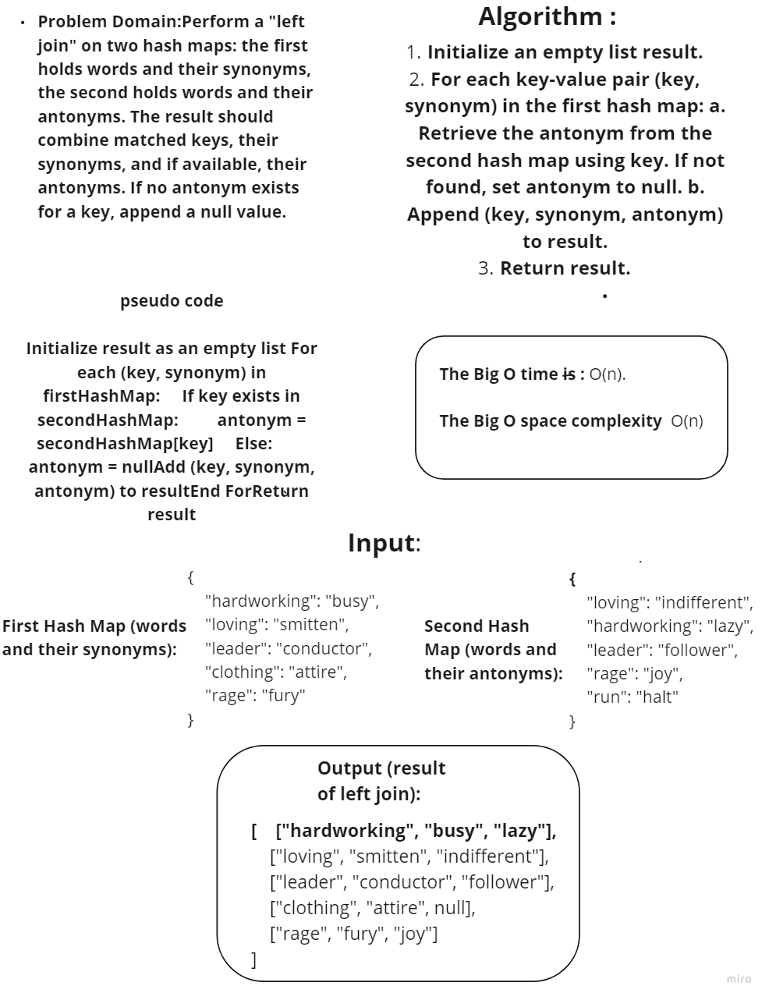
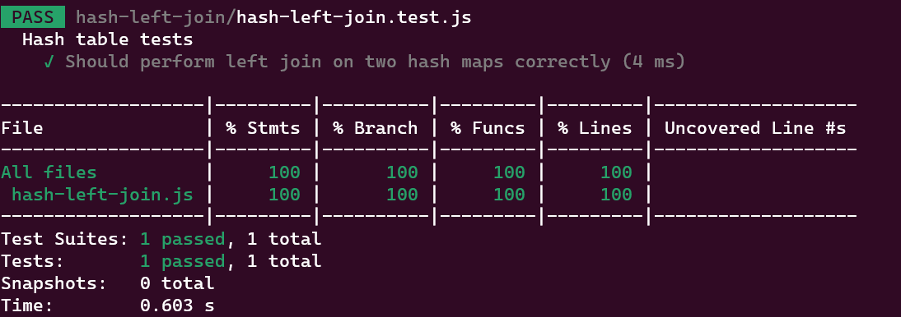

# Hash-Left-Join

### Description:

The hash-left-join function performs a left join operation on two hash maps. In the context of databases, a left join returns all records from the left table (or dataset), and the matched records from the right table. If there is no match, the result is null.

# WhiteBoard

# Testing

